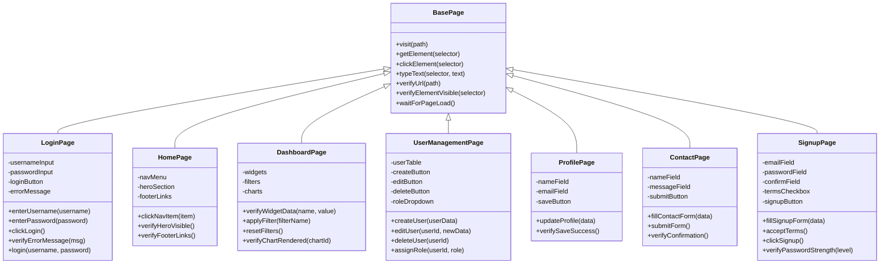

# Cypress 15 + POM + Docker + Jenkins (Parallel) + GitHub Actions — Complete Hybrid POC Plan

---

## Phase 1: Environment Setup (Fresh Machine)

- [x] Install **nvm** (Node Version Manager) to manage and isolate Node.js versions:
  ```bash
  # macOS / Linux
  curl -o- https://raw.githubusercontent.com/nvm-sh/nvm/v0.40.1/install.sh | bash

  # Windows — use nvm-windows
  # Download installer from https://github.com/coreybutler/nvm-windows/releases
  ```
- [x] Verify nvm: `nvm --version`
- [x] Install **Node.js LTS v20+** via nvm:
  ```bash
  nvm install 20
  nvm use 20
  nvm alias default 20
  ```
- [x] Verify Node: `node -v` / `npm -v`
- [x] Create a `.nvmrc` file in the project root to lock the Node version for all contributors:
  ```bash
  echo "20" > .nvmrc
  ```
  > Any contributor can then run `nvm use` in the project directory to auto-switch to the correct version.
- [x] Install **Git** and configure `user.name` / `user.email`
- [x] Install **Java JDK 11+** (required for Jenkins)
- [x] Install **Docker Desktop** (includes Docker Engine + Docker Compose)
- [x] Verify Docker: `docker --version` / `docker compose version`
- [x] Install **VS Code** with extensions: ESLint, Prettier, Docker, GitHub Actions
- [x] Create a **GitHub account** (if not existing) and set up SSH key or PAT

---

## Phase 2: Project Initialization

- [x] Create project directory and switch to the correct Node version:
  ```bash
  mkdir cypress-automation-poc && cd cypress-automation-poc
  nvm use          # reads .nvmrc → switches to Node 20
  npm init -y
  ```
- [x] Install Cypress 15: `npm install cypress@15 --save-dev`
- [x] Install reporters:
  ```bash
  npm install mochawesome mochawesome-merge mochawesome-report-generator --save-dev
  ```
- [x] Open Cypress to scaffold folders: `npx cypress open`
- [x] Create `.gitignore`:
  ```
  node_modules/
  cypress/videos/
  cypress/screenshots/
  mochawesome-report/
  mochawesome-temp/
  .env
  ```
- [x] Initialize Git repo: `git init`

---

## Phase 3: Page Object Model (POM) Architecture

### 3a: POM Folder Structure

```
cypress/
├── e2e/
│   ├── smoke/
│   │   ├── login.smoke.cy.js
│   │   ├── homepage.smoke.cy.js
│   │   └── navigation.smoke.cy.js
│   ├── regression/
│   │   ├── authentication/
│   │   │   ├── login.cy.js
│   │   │   ├── logout.cy.js
│   │   │   ├── forgot-password.cy.js
│   │   │   └── signup.cy.js
│   │   ├── dashboard/
│   │   │   ├── widgets.cy.js
│   │   │   ├── filters.cy.js
│   │   │   └── charts.cy.js
│   │   ├── user-management/
│   │   │   ├── create-user.cy.js
│   │   │   ├── edit-user.cy.js
│   │   │   ├── delete-user.cy.js
│   │   │   └── user-roles.cy.js
│   │   ├── forms/
│   │   │   ├── contact-form.cy.js
│   │   │   ├── profile-form.cy.js
│   │   │   └── search-form.cy.js
│   │   └── api-validation/
│   │       ├── users-api.cy.js
│   │       └── products-api.cy.js
│   └── sanity/
│       ├── app-health.sanity.cy.js
│       └── critical-path.sanity.cy.js
├── pages/
│   ├── BasePage.js
│   ├── LoginPage.js
│   ├── HomePage.js
│   ├── DashboardPage.js
│   ├── UserManagementPage.js
│   ├── ProfilePage.js
│   ├── ContactPage.js
│   └── SignupPage.js
├── fixtures/
│   ├── users.json
│   ├── dashboard.json
│   ├── forms.json
│   └── api-responses.json
├── support/
│   ├── commands.js
│   └── e2e.js
└── downloads/
```

### 3b: Base Page Class

- [x] Create `cypress/pages/BasePage.js` with shared methods:

```js
class BasePage {
  visit(path) { cy.visit(path) }
  getElement(selector) { return cy.get(selector) }
  clickElement(selector) { cy.get(selector).click() }
  typeText(selector, text) { cy.get(selector).clear().type(text) }
  verifyUrl(path) { cy.url().should('include', path) }
  verifyElementVisible(selector) { cy.get(selector).should('be.visible') }
  waitForPageLoad() { cy.document().its('readyState').should('eq', 'complete') }
}
export default BasePage
```

### 3c: Page Object Classes

- [x] Create **LoginPage.js** — selectors + methods for login form, error messages, remember me
- [x] Create **HomePage.js** — navigation menu, hero section, footer links
- [x] Create **DashboardPage.js** — widgets, filters, charts, data tables
- [x] Create **UserManagementPage.js** — user list, create/edit/delete modals, role dropdowns
- [x] Create **ProfilePage.js** — profile form fields, avatar upload, save/cancel
- [x] Create **ContactPage.js** — contact form, validation messages, submit confirmation
- [x] Create **SignupPage.js** — registration form, password strength, terms checkbox

### 3d: Test Suites Against Sample Application

- [x] **Smoke Suite** (3 specs — fast critical path):
  - Login with valid credentials → verify dashboard loads
  - Navigate all main menu items → verify page titles
  - Homepage loads → verify key elements present
- [x] **Regression Suite — Authentication** (4 specs):
  - Login with valid/invalid credentials, locked account, empty fields
  - Logout from different pages
  - Forgot password flow
  - Signup with valid/invalid data, duplicate email
- [x] **Regression Suite — Dashboard** (3 specs):
  - Widget data loads correctly
  - Filters apply and reset
  - Charts render with correct data
- [x] **Regression Suite — User Management** (4 specs):
  - Create user with all fields
  - Edit existing user details
  - Delete user with confirmation
  - Role assignment and permission validation
- [x] **Regression Suite — Forms** (3 specs):
  - Contact form submission with validation
  - Profile form update and save
  - Search form with results verification
- [x] **Regression Suite — API Validation** (2 specs):
  - `cy.request()` for users CRUD endpoints
  - `cy.request()` for products endpoints
- [x] **Sanity Suite** (2 specs — health check):
  - App responds with 200
  - Critical user journey end-to-end

### 3e: Custom Commands

- [x] `cy.login(username, password)` — reusable login via UI
- [x] `cy.apiLogin(username, password)` — login via API (skip UI for speed)
- [x] `cy.resetState()` — clean test data before/after suite
- [x] `cy.waitForApi(alias)` — intercept and wait for API responses

### 3f: Cypress Configuration

- [x] Configure `cypress.config.js`:

```js
module.exports = defineConfig({
  e2e: {
    baseUrl: 'http://localhost:3000',
    viewportWidth: 1280,
    viewportHeight: 720,
    retries: { runMode: 2, openMode: 0 },
    video: true,
    screenshotOnRunFailure: true,
    reporter: 'mochawesome',
    reporterOptions: {
      reportDir: 'mochawesome-temp',
      overwrite: false,
      html: false,
      json: true
    },
    specPattern: 'cypress/e2e/**/*.cy.js'
  }
})
```

- [x] Add npm scripts in `package.json`:

```json
"scripts": {
  "cy:open": "cypress open",
  "cy:smoke": "cypress run --spec 'cypress/e2e/smoke/**'",
  "cy:sanity": "cypress run --spec 'cypress/e2e/sanity/**'",
  "cy:regression": "cypress run --spec 'cypress/e2e/regression/**'",
  "cy:regression:auth": "cypress run --spec 'cypress/e2e/regression/authentication/**'",
  "cy:regression:dashboard": "cypress run --spec 'cypress/e2e/regression/dashboard/**'",
  "cy:regression:users": "cypress run --spec 'cypress/e2e/regression/user-management/**'",
  "cy:regression:forms": "cypress run --spec 'cypress/e2e/regression/forms/**'",
  "cy:regression:api": "cypress run --spec 'cypress/e2e/regression/api-validation/**'",
  "cy:all": "cypress run",
  "report:merge": "mochawesome-merge mochawesome-temp/*.json -o mochawesome-report/merged.json",
  "report:generate": "marge mochawesome-report/merged.json -f report -o mochawesome-report",
  "report": "npm run report:merge && npm run report:generate"
}
```

- [x] Verify all suites pass locally: `npm run cy:all && npm run report`

---

## Phase 4: Docker Setup

### 4a: Dockerfile

- [x] Create `Dockerfile` based on `cypress/included:15`
- [x] Copy project files, install dependencies
- [x] Set default `CMD` to run tests and generate report

### 4b: Docker Compose

- [x] Create `docker-compose.yml` with services:
  - **app** — application under test
  - **cypress** — test runner, depends on `app`
- [x] Configure `depends_on` with health checks
- [x] Volume mounts for `mochawesome-report/`, `cypress/screenshots/`, `cypress/videos/`

### 4c: .dockerignore

- [x] Exclude `node_modules`, `.git`, `cypress/videos`, `cypress/screenshots`, `mochawesome-temp`

### 4d: Validate Docker Locally

- [x] `docker compose up --abort-on-container-exit --exit-code-from cypress`
- [x] Verify Mochawesome HTML report in mounted volume

---

## Phase 5: GitHub Repository Setup

- [x] Create GitHub repository and push codebase to `main`
- [x] Create **branch strategy**: `main`, `develop`, feature branches
- [x] Add **branch protection rules** on `main` — require status checks
- [x] Add **repository secrets**: `CYPRESS_BASE_URL`, app credentials

---

## Phase 6: GitHub Actions — Fast Feedback on PRs (Smoke Only)

> **Role**: Quick gatekeeper. Runs smoke suite on every PR. Blocks merge if tests fail.

- [x] Create `.github/workflows/cypress-smoke.yml`
- [x] **Triggers**: `pull_request` to `main`/`develop`, `push` to `develop`
- [x] **Stages**:
  1. Checkout → `actions/checkout@v4`
  2. Setup Node → `actions/setup-node@v4` with caching
  3. Read `.nvmrc` and install matching Node version via `actions/setup-node@v4`
  4. Install → `npm ci`
  5. Run smoke → `cypress-io/github-action` with `--spec "cypress/e2e/smoke/**"`
  6. Generate Mochawesome report → `npm run report`
  7. Upload artifacts → report + screenshots
  8. PR comment with test summary
- [x] Set as **required status check** on PRs to `main`
- [x] Add **Slack notification** on failure

---

## Phase 7: Jenkins — Regression, Nightly & Parallel Execution

> **Role**: Powerhouse. Full regression with **Jenkins-native parallelism** — splits suites across parallel stages/nodes to cut execution time.

### 7a: Install Jenkins via Docker

- [x] Run Jenkins in Docker:
  ```bash
  docker run -d -p 8080:8080 -p 50000:50000 \
    -v jenkins_home:/var/jenkins_home \
    --name jenkins jenkins/jenkins:lts
  ```
- [x] Complete setup wizard
- [x] Install plugins:
  - **NodeJS Plugin**
  - **Docker Pipeline Plugin**
  - **Git Plugin**
  - **HTML Publisher Plugin** (Mochawesome)
  - **GitHub Plugin** (webhook)
  - **Slack Notification Plugin**
  - **Parallel Test Executor Plugin** (optional, for dynamic splitting)

### 7b: Jenkins Global Configuration

- [x] Configure **NodeJS** under Global Tool Configuration — set version to match `.nvmrc` (v20)
  > This ensures Jenkins uses the same Node version as local development (controlled by nvm/.nvmrc)
- [x] Configure **Docker** agent
- [x] Add **GitHub credentials**
- [x] Add **Cypress environment variables** as Jenkins secrets

### 7c: Jenkinsfile — Parallel Regression Pipeline

> This is the key differentiator for the POC. Jenkins splits the 5 regression sub-suites across **parallel stages**, each running in its own **Docker container**.

- [x] Create `Jenkinsfile` with this structure:

```
Pipeline Stages:

1. Checkout
     └── Pull code from GitHub

2. Install Dependencies
     └── npm ci

3. Parallel Regression (ALL RUN SIMULTANEOUSLY)
     ├── Stage: Auth Tests
     │   └── Docker: cypress/included:15
     │   └── cypress run --spec "cypress/e2e/regression/authentication/**"
     │
     ├── Stage: Dashboard Tests
     │   └── Docker: cypress/included:15
     │   └── cypress run --spec "cypress/e2e/regression/dashboard/**"
     │
     ├── Stage: User Management Tests
     │   └── Docker: cypress/included:15
     │   └── cypress run --spec "cypress/e2e/regression/user-management/**"
     │
     ├── Stage: Forms Tests
     │   └── Docker: cypress/included:15
     │   └── cypress run --spec "cypress/e2e/regression/forms/**"
     │
     └── Stage: API Validation Tests
         └── Docker: cypress/included:15
         └── cypress run --spec "cypress/e2e/regression/api-validation/**"

4. Collect Results
     └── Copy all mochawesome-temp/*.json from each parallel stage

5. Merge & Generate Report
     └── mochawesome-merge → marge → single consolidated HTML

6. Publish Report
     └── HTML Publisher Plugin (viewable in Jenkins UI)

7. Archive Artifacts
     └── Videos + Screenshots from all parallel stages

8. Post Actions
     └── Slack/email notification with pass/fail + report link
```

### 7d: Parallel Execution Strategy Details

- [x] Each parallel stage runs inside its **own Docker container** (`cypress/included:15`)
- [x] Each container targets a **specific spec folder** (suite-level splitting)
- [x] All containers point to the **same application URL**
- [x] Each stage writes Mochawesome JSON to a **shared workspace** (via `stash`/`unstash` or volume)
- [x] After all parallel stages complete, a final stage **merges** all JSON reports into one HTML
- [x] **Execution time comparison for POC demo**:

| Mode | Auth | Dashboard | User Mgmt | Forms | API | Merge | Total |
|---|---|---|---|---|---|---|---|
| Sequential | 5m | 4m | 6m | 3m | 2m | — | ~20 min |
| Parallel | 5m | 4m | 6m | 3m | 2m | 1m | ~7 min |

> **~65-70% reduction in execution time**

### 7e: Jenkinsfile.docker (Fully Docker-Based)

- [x] Alternative Jenkinsfile using `docker compose` to spin up app + parallel cypress containers

### 7f: Jenkins Jobs

- [x] **Cypress-Parallel-Regression** → auto-trigger on merge to main (webhook)
  - Runs all 5 suites in parallel
- [x] **Cypress-Nightly** → cron `H 0 * * *`
  - Full parallel regression across all browsers
- [x] **Cypress-Parameterized** → manual trigger with parameters:
  - Environment: `dev` / `staging` / `prod`
  - Browser: `chrome` / `firefox` / `electron`
  - Suite: `smoke` / `regression` / `all` / individual suites
  - Parallel: `yes` / `no` (to demo the time difference)

### 7g: GitHub ↔ Jenkins Integration

- [x] Configure **GitHub Webhook** → Jenkins (triggers on push to `main`)
- [x] Add Jenkins build status badge in repo README

---

## Phase 8: Mochawesome Reporting Strategy

| Platform | Report Delivery |
|---|---|
| **Local** | `mochawesome-report/report.html` in browser |
| **GitHub Actions** | Downloadable artifact per workflow run |
| **Jenkins** | HTML Publisher — viewable directly in Jenkins dashboard |
| **Jenkins Parallel** | Merged report from all parallel stages into one HTML |
| **GitHub Pages** (optional) | Auto-deploy latest report for client access |

- [x] Each parallel Jenkins stage produces individual Mochawesome JSONs
- [x] Final stage merges all JSONs → single consolidated HTML
- [x] Screenshots embedded inline in report on failure
- [x] Videos archived as separate downloadable artifacts

---

## Phase 9: Notifications

- [x] **GitHub Actions** → Slack on smoke failure
- [x] **Jenkins** → Slack on regression failure (includes parallel stage breakdown)
- [x] **Jenkins** → Email with Mochawesome report link
- [x] Unified Slack channel `#qa-automation`

---

## Phase 10: POC Demo Preparation

### 10a: Demo Flow

1. **Show POM structure** — explain page objects, base class, inheritance
2. **Local run** — `npx cypress open` (headed mode, walk through a test)
3. **Docker run** — `docker compose up` (containerized execution)
4. **PR workflow** — push a branch → create PR → GitHub Actions smoke → green check
5. **Jenkins sequential** — trigger parameterized job with `parallel: no` → note the total time
6. **Jenkins parallel** — trigger same job with `parallel: yes` → show time reduction
7. **Show Jenkins dashboard** — Mochawesome HTML report, videos, screenshots, parallel stage visualization
8. **Show nightly cron** — scheduled full regression config
9. **Show parameterized job** — pick env/browser/suite

### 10b: Key POC Metrics to Collect

| Metric | Sequential | Parallel | Improvement |
|---|---|---|---|
| Total regression time | ~20 min | ~7 min | ~65-70% faster |
| Smoke suite time | ~2 min | N/A (single run) | — |
| Suites executed | 5 | 5 | Same coverage |
| Docker containers | 1 | 5 | Parallel |
| Mochawesome reports | 1 | 5 → merged to 1 | Consolidated |

### 10c: Presentation Materials

- [x] **Architecture diagram** (see below)
- [x] **POM structure diagram** — showing class inheritance and test-to-page mapping
- [x] **Parallel vs Sequential comparison chart** — side-by-side execution timeline
- [x] **Comparison slide**: Cypress vs Selenium vs Playwright
- [x] **Hybrid justification**: GitHub Actions (fast gate) + Jenkins (parallel regression)
- [x] **Scaling recommendations**: add more parallel stages, add nodes, add browsers

---

## Architecture Diagram

> Render the following Mermaid diagrams at [mermaid.live](https://mermaid.live) to get shareable images.

### System Architecture


### POM Class Diagram



### Parallel vs Sequential Execution Timeline


---

## Final Project Structure

```
project-root/
├── .github/
│   └── workflows/
│       ├── cypress-smoke.yml
│       └── cypress-docker.yml
├── cypress/
│   ├── e2e/
│   │   ├── smoke/
│   │   │   ├── login.smoke.cy.js
│   │   │   ├── homepage.smoke.cy.js
│   │   │   └── navigation.smoke.cy.js
│   │   ├── regression/
│   │   │   ├── authentication/
│   │   │   │   ├── login.cy.js
│   │   │   │   ├── logout.cy.js
│   │   │   │   ├── forgot-password.cy.js
│   │   │   │   └── signup.cy.js
│   │   │   ├── dashboard/
│   │   │   │   ├── widgets.cy.js
│   │   │   │   ├── filters.cy.js
│   │   │   │   └── charts.cy.js
│   │   │   ├── user-management/
│   │   │   │   ├── create-user.cy.js
│   │   │   │   ├── edit-user.cy.js
│   │   │   │   ├── delete-user.cy.js
│   │   │   │   └── user-roles.cy.js
│   │   │   ├── forms/
│   │   │   │   ├── contact-form.cy.js
│   │   │   │   ├── profile-form.cy.js
│   │   │   │   └── search-form.cy.js
│   │   │   └── api-validation/
│   │   │       ├── users-api.cy.js
│   │   │       └── products-api.cy.js
│   │   └── sanity/
│   │       ├── app-health.sanity.cy.js
│   │       └── critical-path.sanity.cy.js
│   ├── pages/
│   │   ├── BasePage.js
│   │   ├── LoginPage.js
│   │   ├── HomePage.js
│   │   ├── DashboardPage.js
│   │   ├── UserManagementPage.js
│   │   ├── ProfilePage.js
│   │   ├── ContactPage.js
│   │   └── SignupPage.js
│   ├── fixtures/
│   │   ├── users.json
│   │   ├── dashboard.json
│   │   ├── forms.json
│   │   └── api-responses.json
│   ├── support/
│   │   ├── commands.js
│   │   └── e2e.js
│   └── downloads/
├── cypress.config.js
├── package.json
├── package-lock.json
├── .nvmrc
├── Dockerfile
├── docker-compose.yml
├── .dockerignore
├── Jenkinsfile
├── Jenkinsfile.docker
├── .gitignore
└── README.md
```